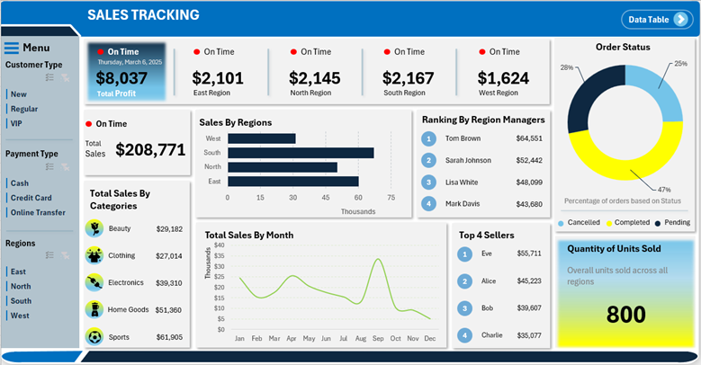

# Sales Tracking Dashboard

## Business Requirement(s)
To conduct a comprehensive sales performance analysis, identifying key trends and opportunities for improvement. The dashboard will provide insights into total sales, profit, regional performance, product category sales, and top-performing sellers using various KPIs and visualizations.

### Dashboard

 
### KPIs Requirements
1. **Total Sales:** The overall revenue generated from sales.
2. **Total Profit:** The total profit earned from all sales transactions.
3. **Profit by Region:** Breakdown of total profit earned from all sales transactions by region.
4. **Sales by Region:** Breakdown of total sales across different regions.
5. **Sales by Category:** Total sales revenue from different product categories.
6. **Order Status Breakdown:** Percentage of orders that are completed, pending, or canceled.
7. **Top 4 Sellers:** The highest-performing sales representatives based on revenue generated.
8. **Ranking for Regional Managers:** Performance ranking of sales managers based on regional sales figures.
9. **Total Quantity Sold:** The overall number of units sold.

### Charts Requirements
1. **Total Sales by Region:**

    **Objective:** Identify the sales contribution of each region. 

    **Chart Type:** Horizontal Bar Chart.

2. **Total Sales by Category:**

    **Objective:** Compare the revenue generated from different product categories. 

    **Chart Type:** Table.

3. **Order Status Breakdown:**

    **Objective:** Analyze the proportion of completed, pending, and canceled orders. 

    **Chart Type:** Donut Chart.

4. **Total Sales by Month:**

    **Objective:** Identify seasonal trends and fluctuations in sales performance. 

    **Chart Type:** Line Chart.

5. **Top 4 Sellers:**

    **Objective:** Highlight the best-performing sales representatives. 

    **Chart Type:** Ranked List.

6. **Ranking for Regional Managers:**

    **Objective:** Display performance rankings of regional managers based on sales. 

    **Chart Type:** Ranked List.

7. **Total Quantity Sold:**

    **Objective:** Show the total number of units sold across all regions. 

    **Chart Type:** KPI Card.

## Executive Summary

### Key Insights
1.	**Total Sales and Profitability:**
      * The total sales amount to **$208,771**, with a total profit of **$8,037**.
      * The sales performance is spread across four regions: East ($2,101), North ($2,145), South ($2,167), and West ($1,624), with the South region leading in sales.
  
2.	Sales Performance by Region:
      * The **South** and **North** regions are the highest contributors to sales, while the West region has the lowest sales performance.
      * Manager rankings indicate that **Tom Brown** leads with the highest regional sales at **$64,551**, followed by **Sarah Johnson ($52,442)** and Lisa White ($48,099).
  
3.	**Top-Selling Product Categories:**
      * The highest revenue-generating categories are:
        * **Sports**: $61,905
        * **Home Goods**: $51,360
        * **Electronics:** $39,310
      * Beauty and Clothing categories generate lower revenue compared to others.
  
4.	**Top Performing Sellers:**
      * The top four sales representatives are:
        * **Eve** ($55,711)
        * **Alice** ($45,223)
        * **Bob** ($39,607)
        * **Charlie** ($35,077)
  
5.	**Sales Trends Over Time:**
      * There are peaks in sales performance in **April, July, and October**, indicating possible seasonal trends.
      * A decline is observed towards **December**, suggesting potential gaps in end-of-year sales strategies.
  
6.	**Order Status Analysis:**
      * **47%** of orders were successfully completed, while **28% are still pending, and 25% were canceled**.
      * The cancellation rate is relatively high, which may indicate customer dissatisfaction, inventory issues, or payment processing problems.
  
7.	**Units Sold:**
      * A total of **800 units** were sold on-time across all regions.
________________________________________

### Recommendations
1.	**Boost Sales in Underperforming Regions:**
      * Implement targeted marketing and promotional campaigns for the West region to improve sales.
      * Provide additional training or incentives for sales teams in lower-performing areas.
  
2.	**Optimize Inventory and Order Fulfillment:**
      * Investigate the reasons behind the **25% order cancellation rate** and address issues related to inventory management, delivery delays, or payment failures.
      * Improve order processing efficiency to reduce pending orders and increase customer satisfaction.
  
3.	**Leverage Seasonal Trends:**
      * Focus on **high-performing months (April, July, October)** to introduce special promotions and maximize revenue.
      * Develop strategies to counteract the sales drop in **December**, such as year-end discounts or holiday season marketing efforts.
  
4.	**Enhance Product Category Sales:**
      * Strengthen sales strategies for **Beauty and Clothing categories**, as they have relatively lower sales compared to other categories.
      * Consider bundling or cross-promotional strategies to boost underperforming categories.
  
5.	**Sales Team Performance Enhancement:**
      * Recognize and reward top performers **(Eve, Alice, Bob, and Charlie)** while identifying areas of improvement for lower-performing sales representatives.
      * Introduce performance-based incentives and sales training programs to enhance productivity.
6.	**Data-Driven Decision Making:**
      * Continuously track and analyze sales trends to refine strategies.
      * Implement predictive analytics to forecast sales and optimize resource allocation.

________________________________________
### Final Thought:
By implementing these recommendations, the organization can enhance sales efficiency, improve customer satisfaction, and maximize profitability.
