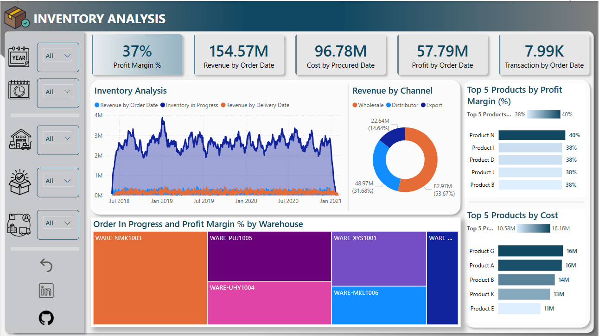

# Inventory Analysis Dashboard

## Business Requirement(s)
To conduct a comprehensive analysis of inventory performance, including revenue trends, cost analysis, profit margins, and warehouse efficiency. The objective is to identify key insights and opportunities for optimization using various KPIs and visualizations in Power BI.

### Dashboard
**Power BI Link:** [Click to view dashboard in Power BI](https://app.powerbi.com/view?r=eyJrIjoiYTEwYjUzYmItYTdkMi00OTVlLWFjYmUtNmNiZGI4NjFiZGYwIiwidCI6IjQ3ZTRlNjcyLWU3ZmYtNDM0OS1iNDBjLWQ4NzE1MTUxZmJiYSIsImMiOjh9) 

### KPIs Requirements
1.	**Profit Margin %:** The percentage of profit relative to revenue.
2.	**Revenue by Order Date:** Total revenue generated over time.
3.	**Cost by Procured Date:** Total procurement cost over time.
4.	**Profit by Order Date:** Total profit calculated from revenue and cost.
5.	**Transaction by Order Date:** The number of inventory transactions over time.

### Charts Requirements
1.	**Inventory Analysis Over Time:**

    **Objective:** Track revenue trends and inventory levels over time.

    **Chart Type:** Line Area Chart.

2.	**Revenue by Channel:**
    
    **Objective:** Analyze revenue distribution across different sales channels (Wholesale, Distributor, Export).
    
    **Chart Type:** Donut Chart.

3.	**Top 5 Products by Profit Margin:**
    
    **Objective:** Identify the most profitable products by percentage margin.
    
    **Chart Type:** Horizontal Bar Chart.

4.	**Top 5 Products by Cost:**
    
    **Objective:** Highlight the most costly products in terms of procurement.
    
    **Chart Type:** Horizontal Bar Chart.

5.	**Order in Progress and Profit Margin by Warehouse:**

    **Objective:** Assess warehouse performance based on order progress and profitability.
    
    **Chart Type:** Treemap.

## Executive Summary

### Key Insights:

1.	**Revenue Trends:** The total revenue by order date is 154.57M, with a declining trend in early 2021, indicating potential issues in sales or demand fluctuations.
2.	**Cost Analysis:** The total cost by procured date is 96.78M, showing a significant portion of expenditure allocated to inventory procurement.
3.	**Profit Margin:** The overall profit margin is 37%, suggesting a relatively healthy profitability level, but there is room for optimization.
4.	**Revenue by Channel:** Wholesale contributes the largest share (53.67%) of revenue, followed by distributors and exports, indicating the importance of wholesale strategies.
5.	**Top Products by Profit Margin:** The most profitable products have margins between 38% and 40%, emphasizing key high-margin items that should be prioritized.
6.	**Top Products by Cost:** The highest-cost products range from 11M to 16M in procurement costs, necessitating cost-control measures for these items.
7.	**Warehouse Performance:** Different warehouses exhibit varying levels of order progress and profitability, suggesting the need for operational efficiency improvements.

________________________________________

### Recommendations for Improvement

1.	**Optimize Procurement Costs:** Focus on reducing costs for the top five most expensive products by negotiating supplier contracts or finding alternative sourcing options.
2.	**Enhance Sales Performance:** Investigate the recent revenue decline and implement targeted marketing campaigns to boost sales in weaker-performing channels.
3.	**Warehouse Efficiency Improvements:** Analyze performance metrics across warehouses and implement best practices in inventory management to reduce delays and optimize stock levels.
4.	**Channel Strategy Optimization:** Since wholesale generates the highest revenue, consider further investments in bulk sales and distribution partnerships to strengthen this channel.
5.	**Product Portfolio Management:** Maintain a strategic focus on high-margin products while evaluating the profitability of lower-margin items for potential discontinuation or pricing adjustments.
6.	**Data-Driven Decision Making:** Regularly monitor inventory metrics in Power BI to identify trends, optimize stock levels, and enhance overall profitability.
