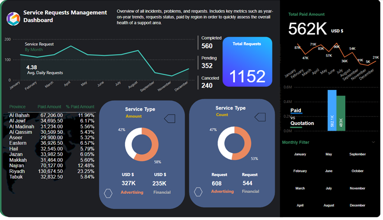

# Service Requests Analysis Dashboard

## Business Requirement(s)
To conduct a comprehensive analysis on service requests, incidents, and financial data to identify key insights and opportunities for optimization using various KPIs and visualizations in Power BI.

### Dashboard
**Power BI Link:** [Click to view dashboard in Power BI](https://app.powerbi.com/view?r=eyJrIjoiNGQ4NTI5NWQtMzM3OC00OWJlLThhN2UtMzM2ZTBlOTgyNTU3IiwidCI6IjQ3ZTRlNjcyLWU3ZmYtNDM0OS1iNDBjLWQ4NzE1MTUxZmJiYSIsImMiOjh9) 

 

### KPIs Requirements
1.	**Total Requests:** The overall count of service requests.
2.	**Average Daily Request Rate:** The average number of service requests per day.
3.	**Total Paid Amount:** The total amount paid for services.
4.	**Service Type Distribution:** The distribution of service types by amount and count.
5.	**Paid vs Quotation:** The comparison between the total paid amount and the total quotation amount.

### Charts Requirements
1.	**Service Request by Month:**

    **Objective:** Analyze the monthly trends in service requests.

    **Chart Type:** Line Graph.

2.	**Total Requests:**

    **Objective:** Summarize the total number of requests, completed requests, pending requests, and canceled requests.

    **Chart Type:** Display Card.

3.	**Total Requests by Status:**

    **Objective:** Summarize the total number of requests by their status (completed requests, pending requests, and canceled requests).

    **Chart Type:** Multi-row Card.

4.	**Total Paid Amount vs Quotation:**

    **Objective:** Show the total amount paid and its monthly distribution.

    **Chart Type:** Clustered Column Chart.

5.	**Province Breakdown:**

    **Objective:** Break down the paid amounts by province and show

    **Chart Type:** Table.

## Executive Summary

### Key Insights:
✅ **Request Volume & Status:**

* Total Requests: **1,152**
* Completed: **560 (48.6%)**
* Pending: **352 (30.5%)**
* Canceled: **240 (20.8%)**
* Average Daily Requests: **4.38**
  * The request completion rate is below **50%**, indicating delays in service resolution.
  * High pending and canceled requests suggest inefficiencies in the request handling process.
  
✅ **Service Type Analysis:**
* Advertising Services: **327K USD** (42% of revenue) | **608 Requests** (47% of total)
* Financial Services: **235K USD** (58% of revenue) | **544 Requests** (53% of total)
  * Financial services generate **higher revenue per request**, while advertising services have a **higher request volume** but contribute less revenue.
  
✅ **Regional Performance:**
* Riyadh leads with **130K USD** (23.25% of total paid amount), followed by **Najran (12.48%)** and **Al Bahah (11.96%)**.
* Other provinces contribute smaller revenue shares, indicating regional disparities in service adoption.
  
✅ **Revenue Trends:**
* Total Paid Amount: **562K USD**
* Highest Revenue Months: **March (83K), May (90K), and July (71K)**
* Lowest Revenue Months: **November (11K) & December (5K)**
  * Revenue fluctuates significantly across months, suggesting seasonal demand variations.
  
✅ **Payment vs. Quotation:**
* Paid Amount: **562K USD**
* Quotation Amount: **483K USD**
* A high conversion rate from quotation to payment indicates strong customer commitment.
________________________________________
### Recommendations for Improvement
1️. **Improve Service Completion Rate**

✅ Identify bottlenecks in service fulfillment and allocate more resources to reduce pending and canceled requests.

✅ Implement a performance tracking system for service teams to boost accountability.

✅ Use automation and AI-driven ticketing systems to optimize request handling and resolution speed.

2️. **Enhance Financial Performance & Service Strategy**

✅ Prioritize high-revenue Financial Services while optimizing Advertising Services pricing to increase profitability.

✅ Expand marketing campaigns to low-revenue provinces to boost regional service adoption.

✅ Offer discounts and promotions during low-revenue months to maintain sales consistency.

3️. **Optimize Customer Experience**

✅ Launch a customer feedback system to understand reasons for request cancellations and service delays.

✅ Introduce real-time request tracking & self-service options to improve customer satisfaction.

✅ Enhance transparency in quotation-to-payment processes to maintain high conversion rates.

4️. **Leverage Data for Predictive Insights**

✅ Use historical request trends to forecast demand and allocate resources effectively.

✅ Implement AI-driven insights to predict peak request periods and optimize workforce allocation accordingly.

✅ Conduct further data segmentation by customer type and demographics to tailor service offerings.

By implementing these recommendations, the organization can increase service efficiency, enhance customer satisfaction, and maximize financial performance.
