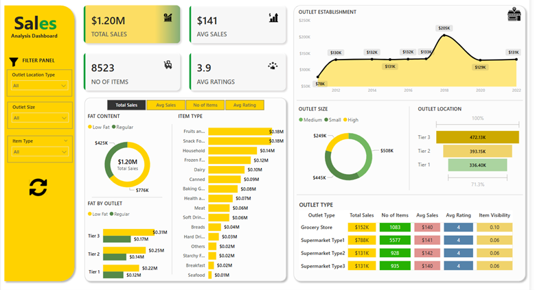

# Sales Analysis Dashboard

## Business Requirement(s)
To conduct a comprehensive analysis on sales performance, customer satisfaction, and inventory distribution to identify key insights and opportunities for optimization using various KPIs and visualizations in Power BI.

### Dashboard
**Power BI Link:** [Click to view dashboard in Power BI](https://app.powerbi.com/view?r=eyJrIjoiYzlkYWExYjEtZTBiMC00NTFmLTk1ODEtMTJkYjkxN2RhMzVkIiwidCI6IjQ3ZTRlNjcyLWU3ZmYtNDM0OS1iNDBjLWQ4NzE1MTUxZmJiYSIsImMiOjh9) 

### KPIs Requirements
1.	**Total Sales:** The overall revenue generated from all items sold.
2.	**Average Sales:** The average revenue per sale.
3.	**Number of Items:** The total count of different items sold.
4.	**Average Rating:** The average customer rating for items sold.

### Charts Requirements
1.	**Total Sales by Fat Content:**

    **Objective:** Analyze the impact of fat content on total sales.

    **Additional KPI Metrics:** Assess how other KPIs (Average Sales, Number of Items, Average Rating) vary with fat content.

    **Chart Type:** Donut Chart.

2.	**Total Sales by Item Type:**

    **Objective:** Identify the performance of different item types in terms of total sales.

    **Additional KPI Metrics:** Assess how other KPIs (Average Sales, Number of Items, Average Rating) vary with fat content.

    **Chart Type:** Bar Chart.

3.	**Fat Content by Outlet for Total Sales:**

    **Objective:** Compare total sales across different outlets segmented by fat content.

    **Additional KPI Metrics:** Assess how other KPIs (Average Sales, Number of Items, Average Rating) vary with fat content.

    **Chart Type:** Stacked Column Chart.

4.	**Total Sales by Outlet Establishment:**

    **Objective:** Evaluate how the age or type of outlet establishment influences total sales.

    **Chart Type:** Line Chart.

5.	**Total Sales by Outlet Size:**

    **Objective:** Analyze the correlation between outlet size and total sales.

    **Chart Type:** Donut/ Pie Chart.

6.	**Sales by Outlet Location:**

    **Objective:** Assess the geographic distribution of sales across different locations.

    **Chart Type:** Funnel Map.

7.	**All Metrics by Outlet Type:**

    **Objective:** Provide a comprehensive view of all key metrics (Total Sales, Average Sales, Number of Items, Average Rating) broken down by different outlet types.

    **Chart Type:** Matrix Card.

## Executive Summary

### Key Insights:
1.	**Overall Sales Performance**
    * The total sales amount to **$1.20M**, with an **average sale of $141** per transaction.
    * A total of **8,523** items have been sold, with an **average rating of 3.9**.
2.	**Sales by Outlet Type**
    * **Supermarket Type 1** dominates sales with **$788K**, followed by **Grocery Stores ($152K)** and **Supermarket Type 2 & 3 ($131K each)**.
    * The **highest** number of **items sold (5,577)** is from **Supermarket Type 1**.
3.	**Sales Trends & Establishment Growth**
    * There is a **peak in sales** around **2018 ($205K)**, followed by a decline and stabilization around **$130K** in later years.
4.	**Outlet Location & Sales Contribution**
    * **Tier 3 outlets** contribute the **highest sales (472.13K)**, followed by **Tier 2 (393.15K)** and **Tier 1 (336.40K)**.
    * **Outlet size matters:** **High-sized outlets** generate the most **revenue ($445K)**, while **small outlets** contribute the **least ($249K)**.
5.	**Product Insights**
* **Fruits, Snack Foods, and Household** Items are the **best-selling categories (~$180K each)**.
* **Seafood and Breakfast** items contribute the **least in sales (~$10K)**.
________________________________________
### Recommendations Aligned with Business Goals
Based on the insights from the Sales Analysis Dashboard, here are specific recommendations tailored to drive business growth:

1️. **Increase Overall Revenue & Profitability**

✅ **Expand High-Performing Outlet Types**
* Prioritize investment in **Supermarket Type 1 and Tier 3 locations** since they contribute the **highest revenue**.
* Open new outlets in **high-demand areas** based on sales trends.
  
✅ **Enhance Pricing & Promotions Strategy**
* Implement **dynamic pricing** for **high-performing** items to maximize profit margins.
* Offer **bundled promotions** for **slow-moving** products like **Seafood & Breakfast** items to clear inventory.

2️. **Optimize Product Offerings & Inventory Management**

✅ **Focus on Best-Selling Categories**
* Allocate more shelf space & marketing budget to **Fruits, Snacks, and Household** Items, the highest revenue generators.
  
✅ **Reduce Low-Performing Products**
* Conduct a **demand analysis** for low-selling items **(Seafood, Breakfast, Starchy Foods)** and decide whether to phase them out or reposition them with targeted discounts.
  
✅ **Data-Driven Inventory Replenishment**
* Implement **AI-driven demand forecasting models** to ensure high-demand products remain in stock and avoid overstocking slow-moving products.

3️. **Enhance Customer Experience & Loyalty**

✅ **Improve Customer Satisfaction & Ratings**
* Investigate reasons behind the **3.9 average rating** and address key pain points through **customer surveys and feedback analysis**.
* Implement **loyalty programs, discounts, and membership perks** to increase repeat customers.
  
✅ **Regional & Outlet-Specific Customization**
* Tailor product offerings to regional customer preferences based on outlet-level sales performance.

4️. **Improve Sales Consistency & Forecasting**

✅ **Analyze Peak Sales Trends from 2018**
* Study **successful campaigns or external factors** that contributed to the **2018 sales spike** and replicate strategies where possible.
  
✅ **Seasonal Sales Strategy**
* Identify **seasonal trends and design targeted marketing campaigns** around peak demand periods.
* Introduce **limited-time offers and exclusive products** to create urgency and boost sales.
  
✅ **Leverage Data Analytics & AI for Decision-Making**
* Utilize Power BI and **machine learning models** to predict sales trends and automate business decisions based on historical performance.
________________________________________
### Final Thought:
By implementing these strategies, the company can increase sales, optimize inventory, improve customer satisfaction, and drive long-term profitability. 
