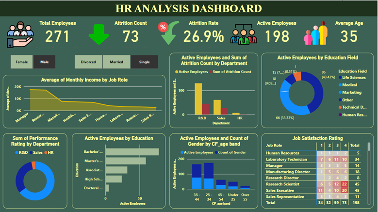

# HR Analysis Dashboard

## Business Requirement(s)
To conduct a comprehensive analysis on employee performance, attrition rates, and job satisfaction to identify key insights and opportunities for optimization using various KPIs and visualizations in Power BI.

### Dashboard
Power BI Link: [Click to view dashboard in Power BI](https://app.powerbi.com/view?r=eyJrIjoiYzVhODI1OTAtYWFiYi00NzhhLTkzY2ItYjExYjFlYjE1N2VhIiwidCI6IjQ3ZTRlNjcyLWU3ZmYtNDM0OS1iNDBjLWQ4NzE1MTUxZmJiYSIsImMiOjh9) 
 

### KPIs Requirements
1.	**Total Employees:** The overall number of employees.
2.	**Active Employees:** The total number of active employees.
3.	**Attrition Rate:** The percentage of employees who have left the company.
4.	**Average Monthly Income:** The average income of employees per month.
5.	**Job Satisfaction Rating:** The average satisfaction rating of employees.
6.	**Average Age:** The average age of employees.

### Charts Requirements
1.	**Attrition Count by Department:**

    **Objective:** Identify which departments have the highest attrition rates.

    **Chart Type:** Clustered Column Chart.

2.	**Average Monthly Income by Job Role:**

    **Objective:** Compare the average monthly income across different job roles.

    **Chart Type:** Line Chart.

3.	**Performance Rating by Department:**

    **Objective:** Assess the performance ratings across different departments.

    **Chart Type:** Donut Chart.

4.	**Gender Distribution:**

    **Objective:** Analyze gender distribution within the company.

    **Chart Type:** Stacked Bar Chart.

5.	**Job Satisfaction Rating by Job Role:**

    **Objective:** Evaluate job satisfaction ratings across different job roles.

    **Chart Type:** Heat Map.

## Executive Summary

### Key Insights:
✅ **Workforce Overview:**
* Total Employees: **271**
* Active Employees: **198**
* Attrition Count: **73**
* Attrition Rate: **26.9%** (Relatively high, indicating potential retention challenges.)
  * The high attrition rate suggests a need for improved employee retention strategies.
* Average Age: **35 Years**
  
✅ **Attrition by Department:**
* **R&D Department:** Highest number of active employees but also the highest attrition.
* **Sales Department:** Significant attrition rate, potentially indicating job dissatisfaction or workload issues.
* **HR Department:** Lowest attrition, possibly reflecting stable work conditions.
  
🔹 R&D and Sales are critical focus areas for retention efforts.

✅ **Employee Education & Job Roles:**
* **Education:** Most employees hold Bachelor’s (largest group) or Master’s degrees.
* **Job Roles:**
  * **Managers & Research Directors** earn the highest monthly income.
  * **Sales** roles have **lower incomes** but **higher attrition and dissatisfaction levels**.
  
🔹 Higher attrition in Sales and R&D may relate to workload, compensation, or career growth concerns.

✅ **Job Satisfaction Ratings:**

* **Research Scientist and Sales Executives** show the highest dissatisfaction **(ratings of 1 & 2)**.
* **Managers and Directors** generally have **higher satisfaction**.
  
🔹 Low satisfaction in scientific and sales roles may be driving attrition.

✅ **Gender & Age Distribution:**
* Majority of employees fall in the **25-44 age range**.
* Few employees are under **25 or over 55**, indicating a gap in early-career hires and senior professionals.
  
🔹 Future hiring strategies should address age diversity to ensure knowledge transfer and workforce continuity.
________________________________________

### Recommendations for Improvement
1️. **Reduce Attrition & Improve Retention**

✅ Conduct **exit interviews** to identify key reasons for attrition in Sales and R&D.

✅ Introduce **mentorship programs and career growth plans** to retain employees.

✅ Offer **competitive compensation packages and performance incentives** for high-turnover roles.

2️. **Enhance Employee Satisfaction**

✅ Address **low job satisfaction** in **Sales & Research** roles with workload management strategies.

✅ Improve employee engagement through **feedback mechanisms and recognition programs**.

✅ Implement flexible work arrangements to boost **work-life balance**.

3️. **Strengthen Workforce Development**

✅ Invest in **leadership training** for high-potential employees.

✅ Increase hiring efforts for **young professionals (under 25)** and **experienced professionals (over 55)** to balance age diversity.

✅ Expand recruitment in **medical and technical fields**, given their lower representation.

4️. **Optimize Performance & Compensation**

✅ Align salaries with **industry benchmarks** to attract and retain top talent.

✅ Provide **sales performance-based incentives** to reduce dissatisfaction.

✅ Ensure **research employees** have clear career progression to prevent turnover.
________________________________________
### Final Thought:
By implementing these strategies, the organization can improve employee satisfaction, reduce attrition, and optimize workforce performance.
