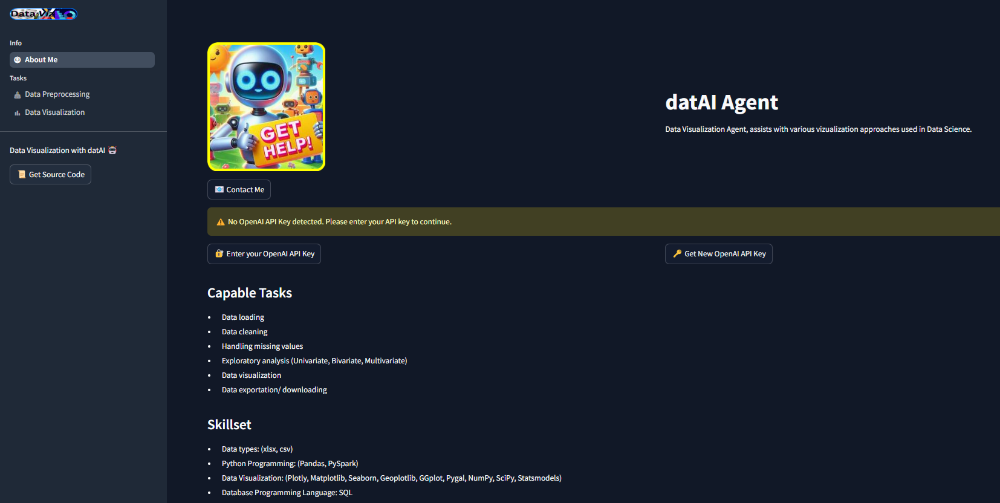

# AI POWERED DATA PROCESSING AND VISUALIZATION APP

AI Agents are finding their way in Data Science and many other key business applications. This approach improves efficiency by huge margins, bringing significant savings to businesses. AI Copilots (Agents) help businesses automate tasks that would normally require lots of hours to complete. Regular tasks in the Data Science workflow such preliminary data assessment, data cleaning, exploratory analysis, and feature engineering can be monotonous and time consuming. The datAI app demonstrates a high-value use-case for AI powered Data Science workflow. 

The demo uses OpenAI models and would require the user to make use of their API key to query the model. Specific capabilities for the app are provided in the next sections.

## Data Uploading and File Handling
Users can upload files through the App interface to permit subsequent operations.

 * Display file details [Name, Size, File Type].

 * Load dataset into dataframe.

 * Preliminary assessment tasks on Dataframe [Shape, Info, Statistical Distribution, Check DUplicates and Nulls].

## Data Cleaning
The datAI app can perform cleaning operations for handling missing values and duplicates.

##### Handling Null Values
1. Deletion Methods
    * Drop Rows → Removes rows with missing values. Useful when missing data is minimal.
    * Drop Columns → Removes columns with too many missing values.
2. Imputation Methods
    * Fill with a Constant → Replaces missing values with a fixed value like 0 or "Unknown".
    * Forward Fill → Fills missing values with the last valid value. Works well for time-series data.
    * Backward Fill → Fills missing values with the next valid value.
    * Mean/Median/Mode Imputation → Replaces missing values with the mean, median, or mode of the column.
    * K-Nearest Neighbors (KNN Imputation) → Predicts missing values based on the nearest neighbors in the dataset.
    * Regression Imputation → Uses regression models to predict missing values based on other features.
3. Advanced Methods
    * Interpolation → Estimates missing values using methods like linear, polynomial, or spline interpolation.
    * Machine Learning-Based Imputation → Uses ML models to predict and fill missing values intelligently.

##### Handling Duplicates
1. Dropping all duplicates (keep=False)
2. Keeping first occurrence (keep="first")
3. Keeping last occurrence (keep="last")

Displays the updated DataFrame after processing.

## File Conversion
The user has options to choose features to retain in the processed dataframe before exporting the final dataframe version.
  * Choose features to appear in final processsed dataframe.
  * Convert file type as preferred.
  * Download the preprocessed data.

## AI Exploratory Data Analysis (EDA):

 * Visualizing data to understand patterns, correlations, and distributions.
 * Identifying any seasonality, trends, or anomalies.
    ###### options for visualization
            - Basic Visuals.
            - Univariate Analysis.
            - Bivariate & Multivariate Analysis.
 The user is presented with options to implement. Once selection is made, the data passes on to the LLM model for prompt generation specific to the dataset. The model presents code and visuals based on the user input and loaded dataframe.

## Sample the Deployed App:
[datAI in Action](https://www.datAI.ap)